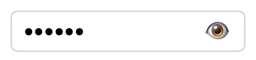
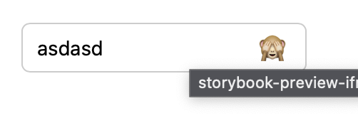
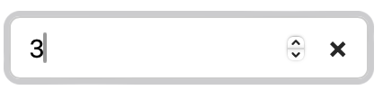
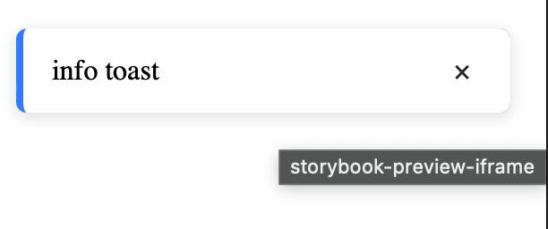
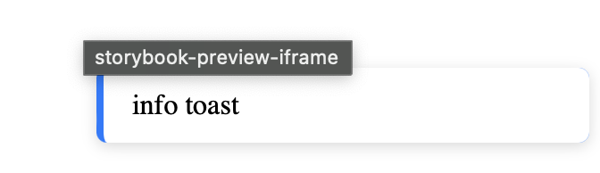
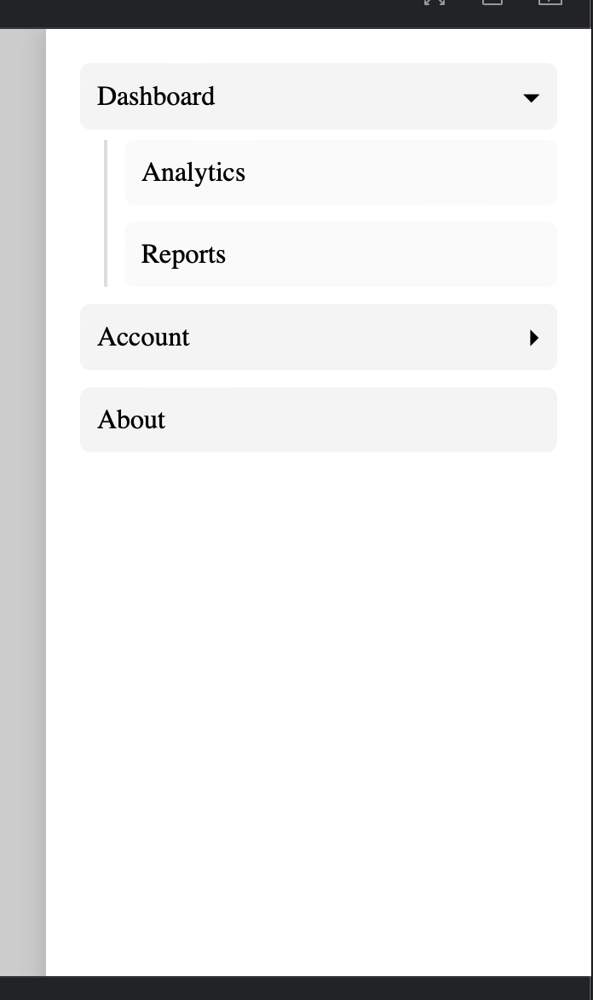

# UI Components Library

A small modular React component library built with TypeScript, Vite, and Storybook. This library provides reusable UI components for modern web applications.

## Features

- **Modular Design**: Each component is self-contained with its own CSS file.
- **TypeScript Support**: Fully typed for better development experience.
- **Storybook Documentation**: Interactive examples for all components.
- **Plain React**: No external UI libraries, just React and CSS.

## Components Overview

### Input
A versatile input component featuring:
- Password visibility toggle
- Clearable button
- Customizable styling via CSS classes









### Toast Notifications
Flexible toast notification system with:
- Auto-dismiss functionality
- Smooth animations
- Bottom-right positioning!
- Multiple toast types (success, error, info, etc.)






### Sidebar Menu
Responsive sidebar navigation with:
- Slide-in animation
- Nested submenus support
- Overlay click to close
- Customizable menu items




## Setup Instructions

### Prerequisites
- Node.js (version 18 or higher)
- npm or yarn package manager

### Installation
1. Clone the repository:
   ```bash
   git clone <repository-url>
   cd test-assessment
   ```

2. Install dependencies:
   ```bash
   npm install
   ```

### Development
- Start the development server:
  ```bash
  npm run dev
  ```
  This will start Vite dev server at `http://localhost:5173`

- Run Storybook for component documentation:
  ```bash
  npm run storybook
  ```
  Storybook will be available at `http://localhost:6006`

### Building
- Build the library:
  ```bash
  npm run build
  ```

- Build Storybook for deployment:
  ```bash
  npm run build-storybook
  ```

### Linting
Run ESLint to check code quality:
```bash
npm run lint
```

## Usage
Import components from their respective directories:

```typescript
import { Input } from './src/components/Input';
import { ToastContainer, useToast } from './src/components/Toast';
import { SidebarMenu } from './src/components/SidebarMenu';
```

Each component comes with its own CSS file that should be imported separately or included in your build process.

## Contributing
1. Follow the existing code style and component structure.
2. Add Storybook stories for new components.
3. Ensure TypeScript types are properly defined.
4. Test components across different browsers.

## License
This project is licensed under the MIT License.